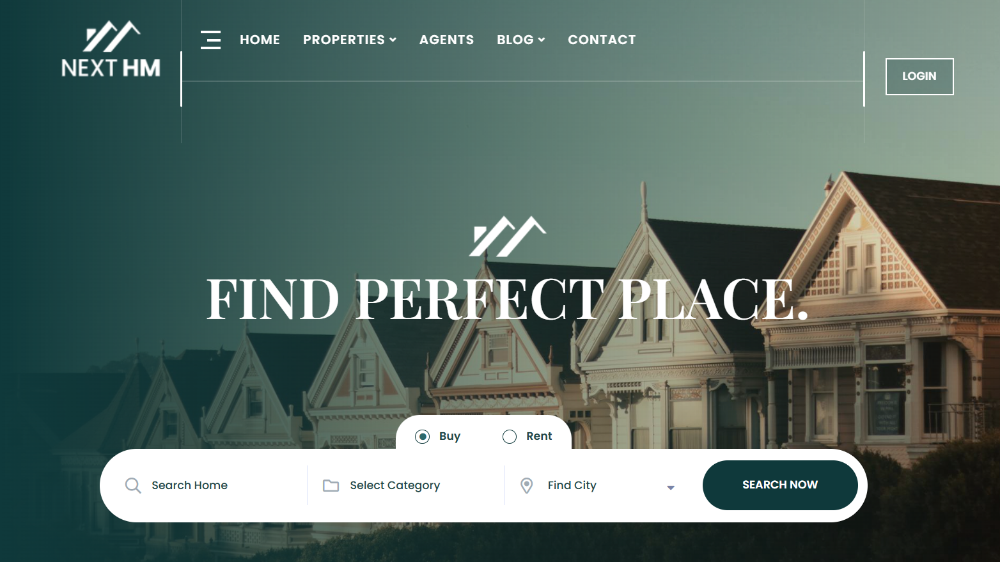
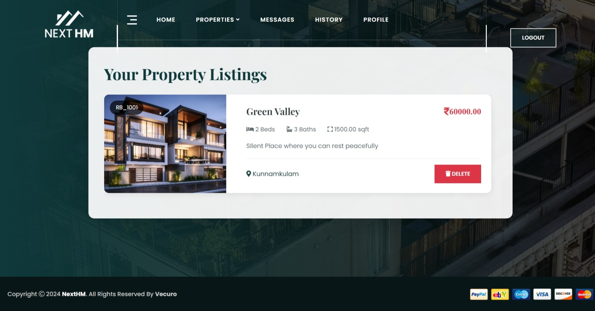
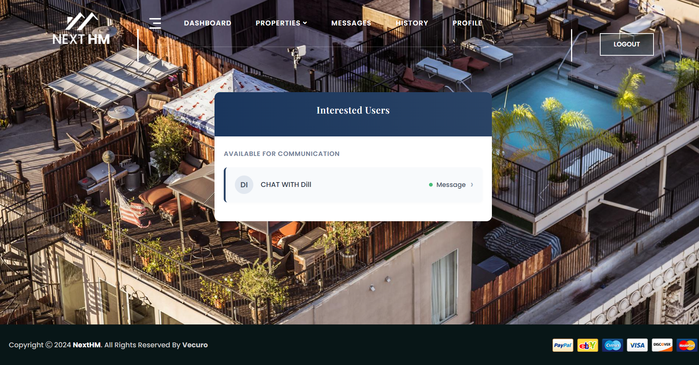

# NextHM 🏡

**NextHM** is a modern web platform for real estate listings and management. It offers intuitive features for both property seekers and agents, aiming to streamline the house hunting and listing experience.

---

## 🔑 Features

- 🔐 User Authentication (Login/Register)
- 🏘️ Property Listings and Advanced Search
- ➕ Add/Edit Properties (for Agents)
- 👤 User and Agent Dashboards
- 💬 Real-time Chat System
- 📞 Contact and Inquiry Forms
- 📄 Informational Pages (About, Contact)
- Responsive design for mobile and desktop

---

## 📸 Screenshots

> Below are some visual highlights from the platform:

### 🏠 Homepage


### 🔐 Login & Register
  


### 📋 Listings & Add Property
  


### 🧑‍💼 Dashboards
  


### 💬 Chat System


### 📞 Contact & About
  


---

## 🚀 Getting Started

Clone the repository and follow the setup instructions:

```bash
git clone https://github.com/Venture-Hacker/NextHM.git
cd NextHM
